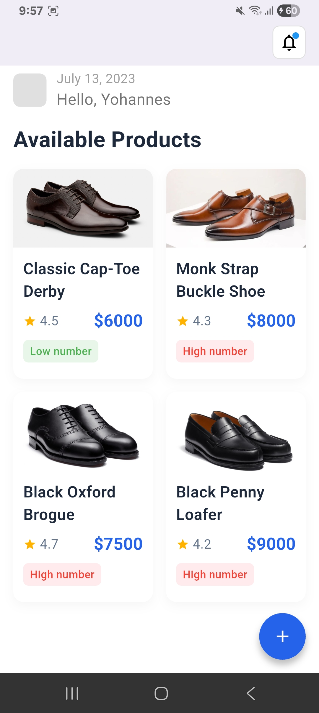
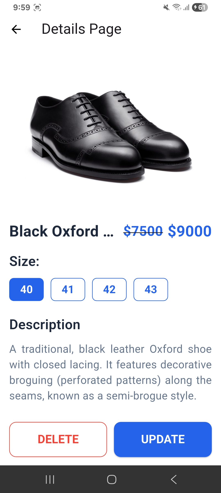

# mikiyas

A new Flutter project.

## 🚀 Task 6: E-commerce UI Layout Implementation

This project contains the implementation of a Flutter user interface for an e-commerce application.

### UI Screenshots

The following screenshots verify the replication of the application layouts:

| 🏠 Home Page | 🛍️ Details Page | ➕ Add Product Page |
|:---:|:---:|:---:|

|  |  |  |
---

## Getting Started

This project is a starting point for a Flutter application.

A few resources to get you started if this is your first Flutter project:

- [Lab: Write your first Flutter app](https://docs.flutter.dev/get-started/codelab)
- [Cookbook: Useful Flutter samples](https://docs.flutter.dev/cookbook)

For help getting started with Flutter development, view the
[online documentation](https://docs.flutter.dev/), which offers tutorials,
samples, guidance on mobile development, and a full API reference.